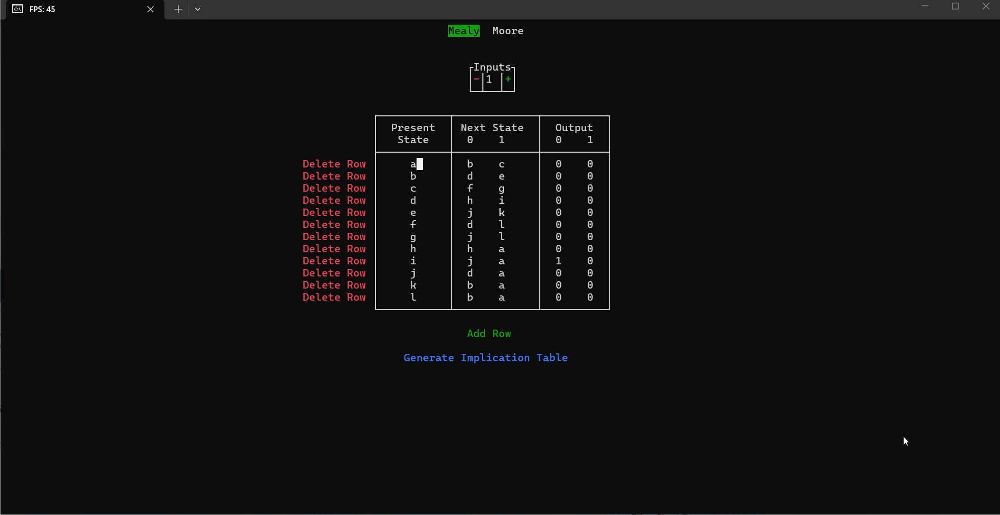

# FSM Minimizer

A framework-free, highly performant C++ Terminal User Interface (TUI) application designed to automate Finite State Machine (FSM) state reduction using the Implication Table method.



---

## Key Features

* **Framework-Free TUI:** Built directly using native Win32 Console APIs (`windows.h`) for lightweight, low-overhead performance.
* **Dual Architecture Support:** Fully supports state table reduction for both **Mealy** and **Moore** sequential machines.
* **Algorithmic Equivalence Testing:** Automatically identifies equivalent state pairs, constructs implication tables, and generates the fully minimized state transition table.
* **Fully Portable Binary:** Zero runtime dependencies—compiled with static GCC linking flags to run standalone on any clean Windows environment without requiring MinGW or toolchain installations.

---

## Quick Start (Pre-Compiled Binary)

1. Navigate to the **[Releases](../../releases)** section of this repository.
2. Download `main.exe` from the latest release assets.
3. Double-click `main.exe` (or execute `.\main.exe` from PowerShell / Command Prompt) to launch the TUI directly.

---

## Building from Source

### Prerequisites

* **GCC/G++** (MinGW-w64 recommended)
* **GNU Make** (`mingw32-make`)

### Build Instructions

Clone the repository and build using the provided `Makefile`:

```powershell
# Clone repository
git clone git@github.com:YOUR_USERNAME/FSM-minimizer.git
cd FSM-minimizer

# Compile portable release binary
mingw32-make

# Run the application
mingw32-make run